# MACRO Strategy

[한국어](README.md) | **English**

### Market-Adaptive Covered-call Regime Optimizer


> **Rotating between MSTR delta exposure and MSTY premium harvest based on volatility regime — quant alpha without options, leverage abuse, or institutional infrastructure.**

Most MSTR/MSTY investors hold a single asset over the long term.
This system quantitatively classifies the **volatility regime** and rotates capital into the asset that the current regime rewards.
The alpha source is not asset selection — it is **rotation timing**.

---

## The Edge

| Market Regime | Action | Alpha |
|---|---|---|
| Sideways + high IV | Harvest option premium via **MSTY** | Convert volatility froth into yield |
| Trend breakout | Remove upside cap via **MSTR (+ MSTU overlay)** | Avoid MSTY's call-exercise drag |
| MSTR underpriced vs. NAV | **MSTR 100%** mean-reversion bet | mNAV mean-reversion |
| Genuine risk-off | **Cash + short-duration MSTZ hedge** | Avoid downside delta + asymmetric payoff |

---

## Strategy Architecture — 4-State Regime Model

| Regime | Trigger | Core | Up Overlay | Down Overlay |
|---|---|---|---|---|
| **Harvest** | IV − RV > 15% & sideways | MSTY 70-100% | — | — |
| **Trend** | BTC breakout & NAV stable | MSTR 70-100% | MSTU ≤25%, ≤5d | — |
| **Value** | mNAV < 1.0 | MSTR 100% | — | — |
| **Risk-off** | BTC support break + IV spike | Cash 75-100% | — | MSTZ ≤25%, ≤3d |

**Hard constraint**: Core (MSTR + MSTY) maintained at ≥70% at all times. Overlay assets combined ≤30%.
Daily-reset volatility drag of leveraged ETFs is contained by 5 operational rules — see [Risk Management](#risk-management).

---

## Signal Architecture — IV Decomposition

Raw MSTR IV alone produces contaminated signals (convertible-bond issuance fears, short squeezes, mNAV froth).
We use BTC IV (Deribit) as a **24/7 leading indicator + denoising baseline** and decompose:

```
MSTR_IV(t) ≈ β · BTC_IV(t − Δ) + EquityPremium(t)
              ─────────────────   ────────────────
              Crypto-side          Equity-side
              (24/7 leading)       (residual signal)
```

| EquityPremium State | Interpretation | System Action |
|---|---|---|
| ≈ 0 | BTC vol explains MSTR vol | Apply core regime rules |
| ↑↑ (+2σ) | Equity-side froth (squeeze, NAV overheat) | Trigger risk-off, exit MSTY |
| ↓ (negative) | MSTR underpricing BTC vol | Long signal (advanced) |
| ↑ & BTC_IV ↑ | Genuine + froth concurrence | Risk-off + downside overlay |

**β estimation**: 90-day rolling regression vs. Kalman state-space adaptive — A/B compared in walk-forward backtest during Phase 2, superior model selected for production.

---

## Data Stack

All sources free. No one-time purchases. Monthly fixed cost: **$0**.

| Tier | Source | Coverage | Role |
|---|---|---|---|
| **1. Crypto-Native** *(24/7 leading)* | Deribit (options, DVOL), Coinbase·Binance (spot), Hyperliquid·Bybit (funding, OI, liquidations) | 5+ years | Leading signal, denoising baseline |
| **2. Equity** *(US hours, primary)* | yfinance (MSTR/MSTU/MSTY/MSTZ OHLCV + distributions), Polygon Options Basic (MSTR options chain 2y EOD) | 2 - 25+ years | Tradable assets' realized returns, MSTR-specific IV |
| **3. Fundamental** | SEC 8-K scrape (MSTR BTC holdings, capital structure), YieldMax IR (MSTY distribution announcements) | 2020-08+ | mNAV (EV-adjusted), distribution timing |
| **4. Macro** | FRED (DGS10, DXY, MOVE) | Decades | Market context |

---

## Tech Stack

| Layer | Tools |
|---|---|
| **Backend** | Python 3.12, FastAPI, SQLAlchemy 2.0 (async), Celery |
| **Database** | PostgreSQL 16 + **TimescaleDB** (hypertables, continuous aggregates, compression) |
| **Cache / Queue** | Redis 7 |
| **Quant** | pandas, numpy, scipy, filterpy (Kalman), vectorbt-style backtester |
| **Frontend** *(Phase 5)* | Next.js 14, Tailwind, TanStack Query, Orval (OpenAPI typed client) |
| **Infrastructure** | Docker Compose, Oracle Cloud Free Tier (Ampere ARM A1, 4c/24GB), Cloudflare Tunnel |
| **Notifications** | Telegram Bot (regime transitions + 9AM daily briefing) |

---

## System Architecture

```mermaid
graph LR
  subgraph S["Data Sources"]
    direction TB
    D[Deribit<br/>BTC Options]
    Y[yfinance<br/>Equities]
    P[Polygon<br/>MSTR Options]
    H[Hyperliquid<br/>Funding/OI]
    F[8-K + IR<br/>Scrapers]
  end

  subgraph I["Ingestion"]
    direction TB
    R[Rate-Limited<br/>Connectors]
    AU[Audit Log]
  end

  subgraph DB["TimescaleDB"]
    direction TB
    OHL[Equity OHLCV]
    OPT[Options Chain]
    BTC[BTC 1m + Options]
    FUN[Fundamentals]
  end

  subgraph Q["Quant Core"]
    direction TB
    IND[VRP, mNAV, RV]
    DEC[IV Decomposition<br/>β·BTC + Residual]
    KAL[Kalman Filter]
    REG[4-State Classifier]
  end

  subgraph O["Output"]
    direction TB
    TG[Telegram Bot]
    DASH[Next.js Dashboard]
    API[FastAPI]
  end

  S --> I --> DB --> Q --> O
```



---

## Project Structure

```
MACRO-Strategy/
├── docker-compose.yml          # core: postgres, redis, app, worker
├── docker-compose.jupyter.yml  # opt-in research env
├── Makefile                    # ops shortcuts
├── services/
│   ├── postgres/init/          # extensions + bootstrap SQL
│   └── app/
│       ├── Dockerfile
│       ├── requirements.txt
│       └── src/
│           ├── api/            # FastAPI (health, regime, indicators)
│           ├── core/           # config, db, ingestor base, rate limiter
│           ├── connectors/     # yfinance / deribit / polygon / hyperliquid
│           ├── workers/        # celery tasks + beat schedule
│           ├── quant/          # indicators, decomposition, regime, backtest
│           └── alerts/         # telegram, daily briefing
├── migrations/                 # alembic versions
└── research/notebooks/         # jupyter (read-only DB role)
```

---

## Roadmap

| Phase | Duration | Status | Deliverable |
|---|---|---|---|
| **1. Foundation** | 2 weeks | **▶ In Progress** | Docker stack, schema, 7 ingestors backfilled |
| **2. Quant Core** | 2-3 weeks | ☐ Planned | Indicators, IV decomposition, β A/B, Kalman, 4-state classifier |
| **3. Backtest Engine** | 2-3 weeks | ☐ Planned | Leveraged-ETF decay model, distribution reinvestment, walk-forward OOS |
| **4. Signal & Alert** | 1-2 weeks | ☐ Planned | Telegram bot, regime transition push, 9AM daily briefing |
| **5. Dashboard** | 2 weeks | ☐ Planned | Next.js mobile-first, Orval typed client |
| **6. Deployment** | 1 week | ☐ Planned | Oracle Cloud ARM, Cloudflare Tunnel, daily DB snapshot to S3-compatible |

Total **9-12 weeks**, solo developer baseline.

---

## Quick Start

```bash
git clone <repo> && cd MACRO-Strategy
make up                  # First run: 5-8 min (image pull + Python deps install)
make verify-health       # → {"status":"ok","db":true,"timescaledb":"2.x.x","redis":true}
make help                # List all targets
```

| Command | Effect |
|---|---|
| `make up` | Start core 4 services (postgres / redis / app / worker) |
| `make jupyter-up` | Add Jupyter (:8888) — research env |
| `make logs` / `make logs-app` | Tail all / app logs |
| `make shell-pg` | psql REPL |
| `make migrate` | Apply pending alembic migrations |
| `make seed-calendar` | Seed market_calendar (NYSE + crypto, 2017-2030) |
| `make verify-tsdb` | Verify TimescaleDB extension |
| `make down` | Stop (data preserved) |
| `make clean` | Stop + remove volumes (confirms — permanent DB data loss) |

---

## Risk Management

Daily-reset volatility drag of leveraged ETFs is contained by operational rules.
**No discretion** — every entry and exit is a pre-defined gate.

### MSTU (2x long, Trend regime)

| Item | Rule |
|---|---|
| Entry gates (all required) | BTC funding ≤ 0 **AND** BTC IV30 < 30D average **AND** mNAV < 1.5x |
| Position cap | ≤ 25% of portfolio |
| Holding period | ≤ 5 trading days, then auto-rollover to MSTR |

### MSTZ (-2x inverse, Risk-off regime) — 5 Rules

| # | Rule | Reason |
|---|---|---|
| 1 | Hold ≤3 trading days (hard stop) | Daily-reset decay accumulates with holding period |
| 2 | Multi-trigger entry (≥3 gates simultaneously) | Single-signal false-positives get eaten by decay |
| 3 | Phased entry (33/33/34 over 3 days) | Whipsaw protection — first false signal exposes only 1/3 |
| 4 | Vol-aware sizing: `alloc = base × (1 − norm_RV20)` | RV is decay's twin — higher RV → smaller position |
| 5 | At MSTR -10%, immediately close 50% | Lock in profit before mean-reversion catches the rebound |

### Core Asset (MSTR + MSTY)

Always ≥ **70%** of portfolio. Overlay is *enhancement*, not bet-the-farm.
Phase 3 backtest will A/B (Core only) vs. (Core + Overlay); Overlay enters production only if OOS Sharpe demonstrably improves.

---

## Disclaimer

This system is **signal-only**.
It does not execute orders automatically and is not a registered investment advisory under Korean 자본시장법 (Capital Markets Act).
All trading decisions and outcomes are the user's sole responsibility.
The system uses mathematical models on historical data; future returns are not guaranteed.
