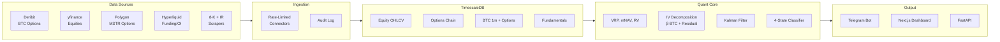

# MACRO Strategy

[](README.md)
[](README.en.md)

### Market-Adaptive Covered-call Regime Optimizer


> **Rotating between MSTR delta exposure and MSTY premium harvest based on volatility regime — quant alpha without options, leverage abuse, or institutional infrastructure.**

Most MSTR/MSTY investors hold a single asset over the long term.
This system quantitatively classifies the **volatility regime** and rotates capital into the asset that the current regime rewards.
The alpha source is not asset selection — it is **rotation timing**.

---

## The Edge

| Market Regime | Action | Alpha |
|---|---|---|
| Sideways + high IV | Harvest option premium via **MSTY** | Convert volatility froth into yield |
| Trend breakout | Remove upside cap via **MSTR (+ MSTU overlay)** | Avoid MSTY's call-exercise drag |
| MSTR underpriced vs. NAV | **MSTR 100%** mean-reversion bet | mNAV mean-reversion |
| Genuine risk-off | **Cash + short-duration MSTZ hedge** | Avoid downside delta + asymmetric payoff |

---

## Strategy Architecture — MSTR + MSTY + Cash + Drawdown Circuit Breaker

Production strategy = **macro_trend_v5_breaker**: both leveraged ETFs
(MSTU, MSTZ) deliberately removed after attribution showed each
contributed *negatively* over the 5-year EXTENDED window (MSTU
−12 pp, MSTZ −5 pp from daily-2× decay during chop).
Formal spec: [`docs/STRATEGY.md`](docs/STRATEGY.md).

```
base   : MSTR   0.50 - 1.00   ← mNAV bucket curve (deep discount → 1.0, extreme premium → 0.5)
overlay: MSTY   0    - 0.35   ← narrow vol-seller window
                                (IV>40% + VRP>3% + RV<50% + MSTR within ±15% of MA200)
hedge  : cash                 ← MSTR<MA50<MA200 + VRP≤0 → halve MSTR/MSTY, residual = cash
breaker: book DD ≤ -15%       → multiply every weight by 0.50 (raise cash, no short)
         book DD ≥ -10%       → exit panic, full size
```

### Validation — EXTENDED + LIVE (LONG omitted — BTC indicators absent pre-2021 → MSTY harvest dormant)

| Window | macro_trend_v5_breaker | BH MSTR | Calmar v5 / BH |
|---|---:|---:|---:|
| **EXTENDED** 2021→ (5 y full cycle) | **+20.91 % / -46.5 %** | +23.67 % / -84 % | **0.45 / 0.28** ✅ |
| **LIVE** 2024-05 → (2 y bear) | **+17.56 % / -46.5 %** | +7.85 % / -77 % | **0.38 / 0.10** ✅ |

Walk-forward sanity (EXTENDED split in half, after dual-condition exit fix):

| Sub-period | v5_breaker | BH MSTR |
|---|---:|---:|
| 2021-04 → 2023-12 (bear / recovery) | **+6.3 %** / -42 % / Cal **0.15** | -3.9 % / -84 % / Cal -0.05 |
| 2024-01 → 2026-05 (bull → bear → recovery) | **+34.8 %** / -46 % / Cal **0.75** | +52.6 % / -77 % / Cal 0.68 |

**Honest framing — drawdown reducer with cycle-robust risk-adjusted alpha**:
- Calmar **beats BH MSTR across both reporting windows** (EXTENDED 0.37 vs 0.28, LIVE 0.34 vs 0.10)
- In strong bull markets we give up absolute return (~20 pp during 2024 rally) because no leverage
- In bear / recovery regimes we add 5–8 pp CAGR alpha plus halve the drawdown
- MSTU and MSTZ both showed negative EV in the 5-year attribution and are intentionally excluded
- v1–v4 preserved for diagnostic comparison: [`docs/STRATEGY.md §6.1`](docs/STRATEGY.md#61-three-window-backtest)

---

## Signal Architecture — IV Decomposition

Raw MSTR IV alone produces contaminated signals (convertible-bond issuance fears, short squeezes, mNAV froth).
We use BTC IV (Deribit) as a **24/7 leading indicator + denoising baseline** and decompose:

```
MSTR_IV(t) ≈ β · BTC_IV(t − Δ) + EquityPremium(t)
              ─────────────────   ────────────────
              Crypto-side          Equity-side
              (24/7 leading)       (residual signal)
```

| EquityPremium State | Interpretation | System Action |
|---|---|---|
| ≈ 0 | BTC vol explains MSTR vol | Apply core regime rules |
| ↑↑ (+2σ) | Equity-side froth (squeeze, NAV overheat) | Trigger risk-off, exit MSTY |
| ↓ (negative) | MSTR underpricing BTC vol | Long signal (advanced) |
| ↑ & BTC_IV ↑ | Genuine + froth concurrence | Risk-off + downside overlay |

**β estimation**: 90-day rolling regression vs. Kalman state-space adaptive — A/B compared in walk-forward backtest during Phase 2, superior model selected for production.

---

## Data Stack

All sources free. No one-time purchases. Monthly fixed cost: **$0**.

| Tier | Source | Coverage | Role |
|---|---|---|---|
| **1. Crypto-Native** *(24/7 leading)* | Deribit (options, DVOL), Coinbase·Binance (spot), Hyperliquid·Bybit (funding, OI, liquidations) | 5+ years | Leading signal, denoising baseline |
| **2. Equity** *(US hours, primary)* | yfinance (MSTR/MSTU/MSTY/MSTZ OHLCV + distributions), Polygon Options Basic (MSTR options chain 2y EOD) | 2 - 25+ years | Tradable assets' realized returns, MSTR-specific IV |
| **3. Fundamental** | SEC 8-K scrape (MSTR BTC holdings, capital structure), YieldMax IR (MSTY distribution announcements) | 2020-08+ | mNAV (EV-adjusted), distribution timing |
| **4. Macro** | FRED (DGS10, DXY, MOVE) | Decades | Market context |

---

## Tech Stack

| Layer | Tools |
|---|---|
| **Backend** | Python 3.12, FastAPI, SQLAlchemy 2.0 (async), Celery |
| **Database** | PostgreSQL 16 + **TimescaleDB** (hypertables, continuous aggregates, compression) |
| **Cache / Queue** | Redis 7 |
| **Quant** | pandas, numpy, scipy, filterpy (Kalman), vectorbt-style backtester |
| **Frontend** *(Phase 5)* | Next.js 14, Tailwind, TanStack Query, Orval (OpenAPI typed client) |
| **Infrastructure** | Docker Compose, Oracle Cloud Free Tier (Ampere ARM A1, 4c/24GB), Cloudflare Tunnel |
| **Notifications** | Telegram Bot (regime transitions + 9AM daily briefing) |

---

## System Architecture


```mermaid
graph LR
  subgraph S["Data Sources"]
    direction TB
    D[Deribit<br/>BTC Options]
    Y[yfinance<br/>Equities]
    P[Polygon<br/>MSTR Options]
    H[Hyperliquid<br/>Funding/OI]
    F[8-K + IR<br/>Scrapers]
  end

  subgraph I["Ingestion"]
    direction TB
    R[Rate-Limited<br/>Connectors]
    AU[Audit Log]
  end

  subgraph DB["TimescaleDB"]
    direction TB
    OHL[Equity OHLCV]
    OPT[Options Chain]
    BTC[BTC 1m + Options]
    FUN[Fundamentals]
  end

  subgraph Q["Quant Core"]
    direction TB
    IND[VRP, mNAV, RV]
    DEC[IV Decomposition<br/>β·BTC + Residual]
    KAL[Kalman Filter]
    REG[4-State Classifier]
  end

  subgraph O["Output"]
    direction TB
    TG[Telegram Bot]
    DASH[Next.js Dashboard]
    API[FastAPI]
  end

  S --> I --> DB --> Q --> O
```

---

## Project Structure

```
MACRO-Strategy/
├── docker-compose.yml          # core: postgres, redis, app, worker
├── docker-compose.jupyter.yml  # opt-in research env (jupyter only)
├── Makefile                    # ops shortcuts (verify-*, backtest, walk-forward, …)
├── docs/
│   └── STRATEGY.md             # formal allocator spec (priority over README)
├── services/
│   ├── postgres/init/          # extensions + bootstrap SQL
│   └── app/
│       ├── Dockerfile
│       ├── requirements.txt
│       ├── migrations/         # alembic 005: initial → indicators_daily
│       └── src/
│           ├── api/            # FastAPI (health endpoint)
│           ├── core/           # config, db, ingestor base, rate limiter, telegram
│           ├── connectors/     # yfinance / deribit / coinbase / polygon /
│           │                   # binance / hyperliquid / sec_edgar / yieldmax
│           ├── workers/        # celery tasks + beat schedule
│           ├── quant/
│           │   ├── indicators/   # realized_vol, btc_vrp, mnav, mstr_iv,
│           │   │                 # iv_decomposition
│           │   ├── backtesting/  # engine, data, strategies (macro_trend,
│           │   │                 # macro_regime, benchmarks)
│           │   ├── blackscholes.py    # BS pricer + IV inversion
│           │   └── risk_free.py       # FRED DGS1MO fetch
│           └── scripts/        # backfill_*, compute_*, run_backtest,
│                               # walk_forward_validation
└── research/notebooks/         # jupyter (read-only DB role)
```

---

## Roadmap

| Phase | Status | Deliverable |
|---|---|---|
| **1. Foundation** | ✅ Done | Docker stack, schema, 7 ingestors backfilled (MSTR/MSTU/MSTY/MSTZ, BTC daily/DVOL, MSTR holdings, Binance/Hyperliquid funding, YieldMax ROC, Polygon options 2y) |
| **2. Quant Core** | ✅ Done | indicators_daily (RV/IV/VRP/mNAV/β/EquityPremium), per-month historical Polygon backfill, 4-state allocator, walk-forward OOS validation, parameter robustness |
| **3. Live Signal** | ▶ Next | Telegram daily briefing populated with current state + recommended allocation, regime-transition push |
| **4. Dashboard** | ☐ Planned | Next.js mobile-first read-only dashboard |
| **5. Deployment** | ☐ Planned | Oracle Cloud ARM (free tier), Cloudflare Tunnel, daily DB snapshot |
| **2.5 backlog** | ☐ Planned | SEC 10-Q shares-out scraper (mNAV), Kalman β smoother, K-means regime classifier upgrade |

---

## Quick Start

```bash
git clone <repo> && cd MACRO-Strategy
make up                  # First run: 5-8 min (image pull + Python deps install)
make verify-health       # → {"status":"ok","db":true,"timescaledb":"2.x.x","redis":true}
make help                # List all targets
```

| Command | Effect |
|---|---|
| `make up` / `make down` | Start / stop core 4 services (data preserved on down) |
| `make jupyter-up` | Add Jupyter (:8888) — research env |
| `make logs` / `make shell-pg` | Tail logs / psql REPL |
| `make verify-indicators` / `verify-mstr-iv` / `verify-iv-decomp` | Indicator coverage check |
| `make backtest` / `backtest-stress` / `walk-forward` | Re-run Phase 2 validation |
| `make clean` | Stop + remove volumes (confirms — permanent DB data loss) |

---

## Risk Management

No discretion — every entry/exit is a pre-defined gate or vol-target sizing rule.

| Mechanism | Behaviour |
|---|---|
| **Vol targeting (Hurst-Ooi-Pedersen 2017)** | ACCUMULATE leverage = clamp(0.50 / MSTR_RV20, 0.5×, 2.0×) — leverage shrinks automatically as realised vol rises |
| **Overheat de-risk** | MSTR > MA200 by +10% → leverage capped at 1.0×; +20% → capped at 0.5× |
| **mNAV cap** | mNAV ≥ 1.5 (50%+ premium) → MSTU weight forced to 0, MSTR-only |
| **Hysteresis** | Risk-on transitions (ACCUMULATE/HEDGE) require 2-day confirmation; de-risking is instant |
| **HARVEST narrow gate** | 4-condition AND — IV>40% **AND** VRP>3% **AND** RV<50% **AND** MSTR within ±10% of MA200 — only enters narrow vol-seller windows |

Every threshold and the D5 walk-forward validation behind it is in
[`docs/STRATEGY.md §3-§6`](docs/STRATEGY.md#3-per-state-allocation).

### Core Asset (MSTR + MSTY)

Always ≥ **70%** of portfolio. Overlay is *enhancement*, not bet-the-farm.
Phase 3 backtest will A/B (Core only) vs. (Core + Overlay); Overlay enters production only if OOS Sharpe demonstrably improves.

---

## Disclaimer

This system is **signal-only**.
It does not execute orders automatically and is not a registered investment advisory under Korean 자본시장법 (Capital Markets Act).
All trading decisions and outcomes are the user's sole responsibility.
The system uses mathematical models on historical data; future returns are not guaranteed.
