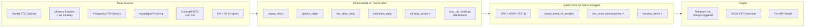

# MACRO Strategy

[](README.md)
[](README.en.md)

### Market-Adaptive Covered-call Regime Optimizer


> **Rotating between MSTR delta exposure and MSTY premium harvest based on volatility regime — quant alpha without options, leverage abuse, or institutional infrastructure.**

Most MSTR/MSTY investors hold a single asset over the long term.
This system quantitatively classifies the **volatility regime** and rotates capital into the asset that the current regime rewards.
The alpha source is not asset selection — it is **rotation timing**.

---

## The Edge

| Market Regime | Action | Alpha |
|---|---|---|
| Sideways + high IV | Harvest option premium via **MSTY** | Convert volatility froth into yield |
| Trend breakout | Remove upside cap via **MSTR (+ MSTU overlay)** | Avoid MSTY's call-exercise drag |
| MSTR underpriced vs. NAV | **MSTR 100%** mean-reversion bet | mNAV mean-reversion |
| Genuine risk-off | **Cash + short-duration MSTZ hedge** | Avoid downside delta + asymmetric payoff |

---

## Strategy Architecture — MSTR + MSTY + Cash + Drawdown Circuit Breaker

Production strategy = **macro_trend_v5_breaker**: both leveraged ETFs
(MSTU, MSTZ) deliberately removed after attribution showed each
contributed *negatively* over the 5-year EXTENDED window (MSTU
−12 pp, MSTZ −5 pp from daily-2× decay during chop).
Formal spec: [`docs/STRATEGY.md`](docs/STRATEGY.md).

```
base   : MSTR   0.50 - 1.00   ← mNAV bucket curve (deep discount → 1.0, extreme premium → 0.5)
overlay: MSTY   0    - 0.35   ← narrow vol-seller window
                                (IV>40% + VRP>3% + RV<50% + MSTR within ±15% of MA200)
hedge  : cash                 ← MSTR<MA50<MA200 + VRP≤0 → halve MSTR/MSTY, residual = cash
breaker: book DD ≤ -15%       → multiply every weight by 0.50 (raise cash, no short)
         book DD ≥ -10% OR
         5-day trend recovery → exit panic, full size (dual-condition exit, D8)
live   : intraday DD ≤ -15%   → live panic state (D10) — actionable signal before
         sustained 15 min       daily close; next daily compute confirms/rejects
```

### Validation — EXTENDED + LIVE (LONG omitted — BTC indicators absent pre-2021 → MSTY harvest dormant)

| Window | macro_trend_v5_breaker | BH MSTR | Calmar v5 / BH |
|---|---:|---:|---:|
| **EXTENDED** 2021→ (5 y full cycle) | **+20.91 % / -46.5 %** | +23.67 % / -84 % | **0.45 / 0.28** ✅ |
| **LIVE** 2024-05 → (2 y bear) | **+17.56 % / -46.5 %** | +7.85 % / -77 % | **0.38 / 0.10** ✅ |

Walk-forward sanity (EXTENDED split in half, after dual-condition exit fix):

| Sub-period | v5_breaker | BH MSTR |
|---|---:|---:|
| 2021-04 → 2023-12 (bear / recovery) | **+6.3 %** / -42 % / Cal **0.15** | -3.9 % / -84 % / Cal -0.05 |
| 2024-01 → 2026-05 (bull → bear → recovery) | **+34.8 %** / -46 % / Cal **0.75** | +52.6 % / -77 % / Cal 0.68 |

**Honest framing — drawdown reducer with cycle-robust risk-adjusted alpha**:
- Calmar **beats BH MSTR across both reporting windows** (EXTENDED 0.37 vs 0.28, LIVE 0.34 vs 0.10)
- In strong bull markets we give up absolute return (~20 pp during 2024 rally) because no leverage
- In bear / recovery regimes we add 5–8 pp CAGR alpha plus halve the drawdown
- MSTU and MSTZ both showed negative EV in the 5-year attribution and are intentionally excluded
- v1–v4 preserved for diagnostic comparison: [`docs/STRATEGY.md §6.1`](docs/STRATEGY.md#61-three-window-backtest)

---

## Signal Architecture — IV Decomposition

Raw MSTR IV alone produces contaminated signals (convertible-bond issuance fears, short squeezes, mNAV froth).
We use BTC IV (Deribit) as a **24/7 leading indicator + denoising baseline** and decompose:

```
MSTR_IV(t) ≈ β · BTC_IV(t − Δ) + EquityPremium(t)
              ─────────────────   ────────────────
              Crypto-side          Equity-side
              (24/7 leading)       (residual signal)
```

| EquityPremium State | Interpretation | System Action |
|---|---|---|
| ≈ 0 | BTC vol explains MSTR vol | Apply core regime rules |
| ↑↑ (+2σ) | Equity-side froth (squeeze, NAV overheat) | Trigger risk-off, exit MSTY |
| ↓ (negative) | MSTR underpricing BTC vol | Long signal (advanced) |
| ↑ & BTC_IV ↑ | Genuine + froth concurrence | Risk-off + downside overlay |

**β estimation**: 90-day rolling regression vs. Kalman state-space adaptive — A/B compared in walk-forward backtest during Phase 2, superior model selected for production.

---

## Data Stack

All sources free. No one-time purchases. Monthly fixed cost: **$0**.

| Tier | Source | Coverage | Role |
|---|---|---|---|
| **1. Crypto-Native** *(24/7 leading)* | Deribit (options, DVOL), Coinbase·Binance (spot), Hyperliquid·Bybit (funding, OI) | 5+ years | Leading signal, denoising baseline |
| **2. Equity** *(US hours, primary)* | yfinance (MSTR/MSTU/MSTY/MSTZ OHLCV + distributions), Polygon Options Basic (MSTR options chain 2y EOD) | 2 - 25+ years | Tradable assets' realized returns, MSTR-specific IV |
| **3. Fundamental** | SEC 8-K scrape (MSTR BTC holdings, capital structure), YieldMax IR (MSTY distribution announcements) | 2020-08+ | mNAV (EV-adjusted), distribution timing |
| **4. Intraday** ⭐ | yfinance MSTR 1m REST + Coinbase BTC spot 1m REST | Real-time (D9+) | live mNAV / live book DD / intraday alert engine |

---

## Tech Stack

| Layer | Tools |
|---|---|
| **Backend** | Python 3.12, FastAPI, SQLAlchemy 2.0 (async), Celery |
| **Database** | PostgreSQL 16 + **TimescaleDB** (hypertables, continuous aggregates, compression) |
| **Cache / State** | Redis 7 (user state, signal dedup, live-panic state machine) |
| **Quant** | pandas, numpy, scipy, vectorbt-style backtester |
| **Notifications** | Telegram Bot (Korean, action-first, change-triggered + heartbeat) |
| **Infrastructure** | Docker Compose, **Oracle Cloud Always-Free** (2× E2.1.Micro split-host, $0/mo) |

---

## System Architecture


```mermaid
graph LR
  subgraph S["Data Sources"]
    direction TB
    D[Deribit BTC Options]
    Y[yfinance Equities<br/>+ 1m intraday]
    P[Polygon MSTR Options]
    H[Hyperliquid Funding]
    C[Coinbase BTC<br/>spot 1m]
    F[8-K + IR Scrapers]
  end

  subgraph DB["TimescaleDB on macro-data"]
    direction TB
    OHL[equity_ohlcv]
    OPT[options_chain]
    BTC[btc_ohlcv_daily]
    IND_T[indicators_daily]
    INT[intraday_prices ⭐]
    FUN[mstr_btc_holdings<br/>distributions]
  end

  subgraph Q["Quant Core on macro-compute"]
    direction TB
    IND[VRP / mNAV / RV / β]
    BT[macro_trend_v5_breaker]
    LP[live_panic state machine ⭐]
    AL[intraday_alerts ⭐]
  end

  subgraph O["Output"]
    direction TB
    TG[Telegram Bot<br/>change-triggered]
    HB[09:00 KST heartbeat]
    API[FastAPI /health]
  end

  S --> DB
  DB --> Q
  Q --> O
```

---

## Project Structure

```
MACRO-Strategy/
├── docker-compose.yml          # local dev: postgres, redis, app, worker
├── deploy/cloud/               # ☁ Oracle Cloud split-host deployment
│   ├── data/    docker-compose.yml + .env.example   (postgres + redis)
│   ├── compute/ docker-compose.yml + .env.example   (app + worker+beat)
│   └── README.md   bootstrap + restore + ops notes
├── docs/STRATEGY.md            # formal allocator spec (priority over README)
├── services/app/
│   ├── Dockerfile
│   ├── migrations/             # alembic 006: + intraday_prices hypertable
│   └── src/
│       ├── api/                # FastAPI (health endpoint)
│       ├── core/
│       │   ├── user_state.py   # ⭐ Redis: balance, deploy_date, fills, signal dedup
│       │   └── notifications/  # telegram client + Korean briefing builders
│       ├── connectors/
│       │   ├── yfinance/coinbase/polygon/binance/hyperliquid/sec_edgar/yieldmax/deribit
│       │   └── intraday_prices.py   # ⭐ 1m polling MSTR (yfinance) + BTC (Coinbase)
│       ├── workers/
│       │   ├── tasks.py            # celery tasks (ingest / compute / briefing / poll / intraday)
│       │   ├── beat_schedule.py    # cron-style schedule
│       │   ├── telegram_handlers.py# ⭐ /today /detail /history /pnl /fill /fills /setbalance /help
│       │   └── intraday_alerts.py  # ⭐ big-move + mNAV-cross + live-panic
│       ├── quant/
│       │   ├── indicators/         # realized_vol, btc_vrp, mnav, mstr_iv, iv_decomposition
│       │   ├── intraday.py         # ⭐ live_mnav + session-move helpers
│       │   ├── live_decision.py    # ⭐ live panic state machine (Redis)
│       │   ├── backtesting/        # engine, data, reports, strategies
│       │   └── blackscholes.py / risk_free.py
│       └── scripts/                # backfill_*, compute_*, run_backtest,
│                                   # walk_forward_validation, validate_live_panic ⭐
└── research/notebooks/             # jupyter (read-only DB role)
```

⭐ = added during D8-D11 (briefing UI, intraday alerts, live panic, fills tracking, cloud split-host)

---

## Roadmap

| Phase | Status | Deliverable |
|---|---|---|
| **1. Foundation** | ✅ Done | Docker stack, schema, 8 ingestors backfilled (MSTR family, BTC daily/DVOL, MSTR holdings, Binance/Hyperliquid funding, YieldMax ROC, Polygon options 2y) |
| **2. Quant Core** | ✅ Done | indicators_daily (RV/IV/VRP/mNAV/β/EquityPremium), per-month historical Polygon backfill, walk-forward OOS, parameter sweeps, attribution |
| **3. Production Strategy** | ✅ Done | `macro_trend_v5_breaker` — dual-condition panic exit (D8); MSTU/MSTZ removed after net-negative attribution; 9-year backtest validated |
| **4. Telegram Bot (D9)** | ✅ Done | Korean action-first briefing, /today /detail /history /pnl /help, inline keyboard, change-triggered (no fluff), share-quantity calc |
| **4a. Phase 2 intraday (D9)** | ✅ Done | `intraday_prices` hypertable, MSTR + BTC 1m polling, 3 alert types (big move, mNAV bucket cross, pre-close warning) |
| **4b. Live Panic (D10)** | ✅ Done | `live_decision` state machine — 15-min sustained intraday DD → action signal; historical false-alarm rate 1.8% |
| **5. Cloud Deployment** | ✅ Done | Oracle Cloud Always-Free split-host (data + compute on 2 micro instances), $0/mo, auto-restart on reboot |
| **6. Live-Trading Ops (D11)** | ✅ Done | 09:00 KST heartbeat (silent on quiet days), daily pg_dump (7-day rotation), `/fill /fills` real-trade tracker with mark-to-market PnL |
| **7. Backlog** | ☐ | SEC 10-Q shares-out scraper (mNAV historical accuracy), real-fill execution-quality dashboard, Object Storage off-host backup |

---

## Live Operation — Telegram Bot

Running 24/7 in the cloud. Fires only on target changes (silent ✅ heartbeat otherwise) so quiet days don't ring your phone.

### User commands

| Command | Effect |
|---|---|
| `/setbalance <USD>` | Register investable capital (used for share-count calculation) |
| `/today` | Current target allocation + share quantities |
| `/detail` | Prices / mNAV (daily + live) / VRP / β / backtest DD |
| `/history` | Backtest cumulative returns (lifetime / year / last 12 months, vs BH) |
| `/pnl` | Real PnL from recorded fills + simulated backtest PnL, side-by-side |
| `/fill <ticker> <shares> <price> [date]` | Record an actual trade (negative shares = sell) |
| `/fills` | List all recorded trades + current holdings |
| `/reset` | Wipe registration + fills (clean restart) |
| `/help` | Strategy explanation + command help |

### Automated alerts

| Type | Trigger | Cadence |
|---|---|---|
| **🚨 Signal change** | Target weights change vs. last sent | Post daily-close (~22:30 UTC) |
| **🔔 Big move** | MSTR ±5 % intraday (±10 % danger) | US session, dedup'd per day per direction |
| **🔔 mNAV bucket cross** | Crosses 0.95 / 1.20 / 1.50 / 2.00 | US session, dedup'd per boundary per day |
| **🚨🚨 LIVE PANIC** | Live book DD ≤ -15 % sustained 15 min | US session, dedup'd per day |
| **✅ Heartbeat** | Silent one-liner on quiet days | 09:00 KST daily |

### Deployment

```bash
# Local dev
git clone <repo> && cd MACRO-Strategy
make up
make verify-health  # → {"status":"ok","db":true,"timescaledb":"2.x.x","redis":true}

# Cloud (Oracle Always-Free, $0/mo)
# Full guide: deploy/cloud/README.md
```

### Local Makefile targets

| Command | Effect |
|---|---|
| `make up` / `make down` | Start / stop core 4 services (data preserved on down) |
| `make jupyter-up` | Add Jupyter (:8888) — research env |
| `make logs` / `make shell-pg` | Tail logs / psql REPL |
| `make verify-indicators` / `verify-mstr-iv` / `verify-iv-decomp` | Indicator coverage check |
| `make backtest` / `backtest-stress` / `walk-forward` | Re-run Phase 2 validation |
| `make clean` | Stop + remove volumes (confirms — permanent DB data loss) |

---

## Risk Management

No discretion — every weight decision is mNAV bucket + trend filter + safety stops.

| Mechanism | Behaviour |
|---|---|
| **mNAV bucket curve** | mNAV ≤ 0.95 → MSTR 100 %; 0.95–1.20 → 90 %; 1.20–1.50 → 80 %; 1.50–2.00 → 65 %; > 2.00 → 50 %. Auto-deleverage as premium rises |
| **MSTY narrow harvest** | 4-condition AND — VRP > 3 % **AND** RV < 50 % **AND** IV > 40 % **AND** MSTR within ±15 % of MA200 — only opens MSTY in narrow vol-seller windows |
| **Trend hedge** | MSTR < MA50 < MA200 **AND** VRP ≤ 0 → every weight × 0.5 (raise cash, no short) |
| **Drawdown breaker (daily)** | Book DD ≤ -15 % **AND** trend not confirmed → every weight × 0.5.  Exit on dual condition (DD ≥ -10 % OR 5-day trend confirm) |
| **Live panic (intraday)** | Live book DD ≤ -15 % sustained 15 min → fire actionable signal + apply panic weights before daily close.  Next daily compute confirms / rejects |
| **MSTU / MSTZ excluded** | Both showed net-negative EV in the 5-year attribution and are deliberately removed.  Korean retail has no 1× inverse alternative |

Every threshold and the walk-forward validation behind it lives in
[`docs/STRATEGY.md §3-§6`](docs/STRATEGY.md#3-per-state-allocation).

---

## Disclaimer

This system is **signal-only**.
It does not execute orders automatically and is not a registered investment advisory under Korean 자본시장법 (Capital Markets Act).
All trading decisions and outcomes are the user's sole responsibility.
The system uses mathematical models on historical data; future returns are not guaranteed.
