# MACRO Strategy

### Market-Adaptive Covered-call Regime Optimizer


> **Rotating between MSTR delta exposure and MSTY premium harvest based on volatility regime — quant alpha without options, leverage abuse, or institutional infrastructure.**

대부분의 MSTR/MSTY 투자자는 한 자산을 무지성으로 보유합니다.
본 시스템은 **변동성 국면(Regime)을 정량 분류**해서, 각 국면이 보상하는 자산으로 자동 회전시킵니다.
알파의 원천은 자산 선택이 아니라 **회전 타이밍**.

---

## The Edge

| 시장 | 시스템의 액션 | 왜 이게 알파인가 |
|---|---|---|
| 횡보 + IV 높음 | **MSTY**로 옵션 프리미엄 수확 | 변동성 거품을 배당으로 환원 |
| 추세 돌파 | **MSTR (+ MSTU 옵션)**로 상방 캡 제거 | MSTY의 콜 행사 손실 회피 |
| MSTR이 NAV 대비 저평가 | **MSTR 100%** 평균 회귀 베팅 | mNAV mean-reversion |
| 진성 risk-off | **Cash + MSTZ 단기 hedge** | 하방 델타 회피 + 비대칭 페이오프 |

---

## Strategy Architecture — 4-State Regime Model

| Regime | Trigger | Core | Up Overlay | Down Overlay |
|---|---|---|---|---|
| **Harvest** | IV − RV > 15% & sideways | MSTY 70-100% | — | — |
| **Trend** | BTC breakout & NAV stable | MSTR 70-100% | MSTU ≤25%, ≤5d | — |
| **Value** | mNAV < 1.0 | MSTR 100% | — | — |
| **Risk-off** | BTC support break + IV spike | Cash 75-100% | — | MSTZ ≤25%, ≤3d |

**Hard constraint**: Core (MSTR + MSTY) 상시 ≥70%. Overlay 자산은 합쳐서 ≤30%.
레버리지 ETF의 daily-reset 변동성 드래그를 5개 운영 규칙으로 봉쇄 — 자세히는 [Risk Management](#risk-management) 참조.

---

## Signal Architecture — IV Decomposition

순수 MSTR IV 만으론 신호가 오염됩니다 (전환사채 발행 우려, 숏 스퀴즈, mNAV 거품).
BTC IV(Deribit)를 **24/7 leading indicator + denoising baseline**으로 사용해 분해:

```
MSTR_IV(t) ≈ β · BTC_IV(t − Δ) + EquityPremium(t)
              ─────────────────   ────────────────
              Crypto-side          Equity-side
              (24/7 leading)       (residual signal)
```

| EquityPremium 상태 | 해석 | 시스템 액션 |
|---|---|---|
| ≈ 0 | BTC vol이 MSTR vol을 설명 | Core regime 룰 그대로 |
| ↑↑ (+2σ) | 주식판 거품 (squeeze, NAV 과열) | Risk-off 게이트, MSTY exit |
| ↓ (음수) | MSTR이 BTC vol 저평가 | Long 시그널 (advanced) |
| ↑ & BTC_IV ↑ | 진성 + 거품 동조 | Risk-off + downside overlay |

**β estimation**: 90-day rolling regression vs Kalman state-space adaptive — Phase 2에서 walk-forward A/B 후 우월 모델 채택.

---

## Data Stack

전 소스 무료. 1회성 결제 없음. 월 고정비 **$0**.

| Tier | Source | Coverage | Role |
|---|---|---|---|
| **1. Crypto-Native** *(24/7 leading)* | Deribit (옵션, DVOL), Coinbase·Binance (현물), Hyperliquid·Bybit (펀딩, OI, 청산) | 5+ years | 선행 시그널, denoising baseline |
| **2. Equity** *(US hours, primary)* | yfinance (MSTR/MSTU/MSTY/MSTZ OHLCV + 분배), Polygon Options Basic (MSTR 옵션 chain 2y EOD) | 2 - 25+ years | 거래 가능한 자산의 실제 수익률, MSTR-specific IV |
| **3. Fundamental** | SEC 8-K scrape (MSTR BTC holdings, capital structure), YieldMax IR (MSTY 분배 발표) | 2020-08+ | mNAV(EV-adjusted), 분배 timing |
| **4. Macro** | FRED (DGS10, DXY, MOVE) | Decades | 시장 컨텍스트 |

---

## Tech Stack

| Layer | Tools |
|---|---|
| **Backend** | Python 3.12, FastAPI, SQLAlchemy 2.0 (async), Celery |
| **Database** | PostgreSQL 16 + **TimescaleDB** (hypertables, continuous aggregates, compression) |
| **Cache / Queue** | Redis 7 |
| **Quant** | pandas, numpy, scipy, filterpy (Kalman), vectorbt-style backtester |
| **Frontend** *(Phase 5)* | Next.js 14, Tailwind, TanStack Query, Orval (OpenAPI typed client) |
| **Infrastructure** | Docker Compose, Oracle Cloud Free Tier (Ampere ARM A1, 4c/24GB), Cloudflare Tunnel |
| **Notifications** | Telegram Bot (regime transitions + 9AM daily briefing) |

---

## System Architecture

```mermaid
graph LR
  subgraph S["Data Sources"]
    direction TB
    D[Deribit<br/>BTC Options]
    Y[yfinance<br/>Equities]
    P[Polygon<br/>MSTR Options]
    H[Hyperliquid<br/>Funding/OI]
    F[8-K + IR<br/>Scrapers]
  end

  subgraph I["Ingestion"]
    direction TB
    R[Rate-Limited<br/>Connectors]
    AU[Audit Log]
  end

  subgraph DB["TimescaleDB"]
    direction TB
    OHL[Equity OHLCV]
    OPT[Options Chain]
    BTC[BTC 1m + Options]
    FUN[Fundamentals]
  end

  subgraph Q["Quant Core"]
    direction TB
    IND[VRP, mNAV, RV]
    DEC[IV Decomposition<br/>β·BTC + Residual]
    KAL[Kalman Filter]
    REG[4-State Classifier]
  end

  subgraph O["Output"]
    direction TB
    TG[Telegram Bot]
    DASH[Next.js Dashboard]
    API[FastAPI]
  end

  S --> I --> DB --> Q --> O
```



---

## Project Structure

```
MACRO-Strategy/
├── docker-compose.yml          # core: postgres, redis, app, worker
├── docker-compose.jupyter.yml  # opt-in research env
├── Makefile                    # ops shortcuts
├── services/
│   ├── postgres/init/          # extensions + bootstrap SQL
│   └── app/
│       ├── Dockerfile
│       ├── requirements.txt
│       └── src/
│           ├── api/            # FastAPI (health, regime, indicators)
│           ├── core/           # config, db, ingestor base, rate limiter
│           ├── connectors/     # yfinance / deribit / polygon / hyperliquid
│           ├── workers/        # celery tasks + beat schedule
│           ├── quant/          # indicators, decomposition, regime, backtest
│           └── alerts/         # telegram, daily briefing
├── migrations/                 # alembic versions
└── research/notebooks/         # jupyter (read-only DB role)
```

---

## Roadmap

| Phase | Duration | Status | Deliverable |
|---|---|---|---|
| **1. Foundation** | 2 weeks | **▶ In Progress** | Docker stack, schema, 7 ingestors backfilled |
| **2. Quant Core** | 2-3 weeks | ☐ Planned | Indicators, IV decomposition, β A/B, Kalman, 4-state classifier |
| **3. Backtest Engine** | 2-3 weeks | ☐ Planned | Leveraged-ETF decay model, distribution reinvestment, walk-forward OOS |
| **4. Signal & Alert** | 1-2 weeks | ☐ Planned | Telegram bot, regime transition push, 9AM daily briefing |
| **5. Dashboard** | 2 weeks | ☐ Planned | Next.js mobile-first, Orval typed client |
| **6. Deployment** | 1 week | ☐ Planned | Oracle Cloud ARM, Cloudflare Tunnel, daily DB snapshot to S3-compatible |

총 **9-12주**. 솔로 개발 기준.

---

## Quick Start

```bash
git clone <repo> && cd MACRO-Strategy
make up                  # 첫 실행: 5-8분 (이미지 pull + Python 패키지 설치)
make verify-health       # → {"status":"ok","db":true,"timescaledb":"2.x.x","redis":true}
make help                # 모든 타깃 리스트
```

| Command | Effect |
|---|---|
| `make up` | core 4 서비스 시작 (postgres / redis / app / worker) |
| `make jupyter-up` | 추가로 Jupyter (:8888) — research env |
| `make logs` / `make logs-app` | 전체 / app 로그 tail |
| `make shell-pg` | psql REPL |
| `make verify-tsdb` | TimescaleDB extension 확인 |
| `make down` | 정지 (데이터 보존) |
| `make clean` | 정지 + volume 삭제 (확인 프롬프트 — DB 데이터 영구 삭제) |

---

## Risk Management

레버리지 ETF의 daily-reset 변동성 드래그를 운영 규칙으로 봉쇄.
**자유 재량 금지** — 모든 진입·청산은 사전 정의된 게이트.

### MSTU (2x long, Trend regime)

| 항목 | 룰 |
|---|---|
| 진입 게이트 (모두 통과) | BTC funding ≤ 0 **AND** BTC IV30 < 30D 평균 **AND** mNAV < 1.5x |
| 비중 캡 | portfolio의 ≤ 25% |
| 보유 기간 | ≤ 5 trading days, 이후 자동으로 MSTR로 rollover |

### MSTZ (-2x inverse, Risk-off regime) — 5 규칙

| # | 규칙 | 이유 |
|---|---|---|
| 1 | 보유 ≤3 trading days (hard stop) | daily 리셋 decay는 보유일에 비례 |
| 2 | 다중 트리거 진입 (≥3 게이트 동시) | 단일 시그널 false-positive가 decay에 잡힘 |
| 3 | 단계적 entry (33/33/34, 3일 분할) | whipsaw 보호, 첫 false 시그널은 1/3만 노출 |
| 4 | Vol-aware 사이징: `alloc = base × (1 − norm_RV20)` | RV가 decay의 twin — 높을수록 비중 자동 축소 |
| 5 | MSTR -10%에서 50% 즉시 익절 | 반등에서 mean-reversion에 잡히기 전에 확정 |

### Core 자산 (MSTR + MSTY)

항상 portfolio의 **≥ 70%** 점유. Overlay는 *enhancement*이지 bet-the-farm 아님.
Phase 3 backtest에서 (Core only) vs (Core + Overlay) A/B 후 OOS Sharpe 우월할 때만 Overlay production 채택.

---

## Disclaimer

본 시스템은 **시그널 전용 (Signal-only)**입니다.
자동 주문 실행을 수행하지 않으며, 한국 자본시장법상 투자자문업이 아닙니다.
모든 매매 결정과 결과의 책임은 사용자 본인에게 있습니다.
과거 데이터를 기반으로 한 수리 모델이며 미래 수익을 보장하지 않습니다.
