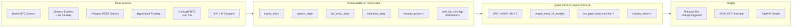

# MACRO Strategy

[](README.md)
[](README.en.md)

### Market-Adaptive Covered-call Regime Optimizer


> **Rotating between MSTR delta exposure and MSTY premium harvest based on volatility regime — quant alpha without options, leverage abuse, or institutional infrastructure.**

대부분의 MSTR/MSTY 투자자는 한 자산만을 장기적으로 보유합니다.
본 시스템은 **변동성 국면(Regime)을 정량 분류**해서, 각 국면이 보상하는 자산으로 자동 회전시킵니다.
알파의 원천은 자산 선택이 아니라 **회전 타이밍**.

---

## The Edge

| Market Regime | Action | Alpha |
|---|---|---|
| 횡보 + IV 높음 | **MSTY**로 옵션 프리미엄 수확 | 변동성 거품을 배당으로 환원 |
| 추세 돌파 | **MSTR (+ MSTU 옵션)**로 상방 캡 제거 | MSTY의 콜 행사 손실 회피 |
| MSTR이 NAV 대비 저평가 | **MSTR 100%** 평균 회귀 베팅 | mNAV mean-reversion |
| 진성 risk-off | **Cash + MSTZ 단기 hedge** | 하방 델타 회피 + 비대칭 페이오프 |

---

## Strategy Architecture — MSTR + MSTY + Cash + Drawdown Circuit Breaker

배포 strategy = **macro_trend_v5_breaker**: 두 leveraged ETF (MSTU, MSTZ) 모두 제거.
attribution 결과 둘 다 net-negative EV로 검증됨 (MSTU −12pp, MSTZ −5pp). 정식 사양: [`docs/STRATEGY.md`](docs/STRATEGY.md).

```
base   : MSTR    0.50 - 1.00   ← mNAV bucket curve (deep discount → 1.0, extreme premium → 0.5)
overlay: MSTY    0   - 0.35   ← narrow vol-seller window
                                (IV>40% + VRP>3% + RV<50% + MSTR이 MA200 ±15%)
hedge  : cash                  ← MSTR < MA50 < MA200 + VRP ≤ 0 → MSTR/MSTY 절반, 나머지 cash
breaker: book DD ≤ -15%        → 모든 weight × 0.50 (cash 증가, 숏 안 함)
         book DD ≥ -10% OR
         5d trend recovery     → normal mode (dual-condition exit, D8)
live   : 장중 DD ≤ -15% 15분    → live panic state (D10) — 일봉 종가 전 즉시 매도 신호
         지속 시                  다음 일봉이 confirm/reject
```

### Validation — EXTENDED + LIVE (LONG 생략 — pre-2021엔 BTC 지표 없어 MSTY harvest 작동 불가)

| Window | macro_trend_v5_breaker | BH MSTR | Calmar v5 / BH |
|---|---:|---:|---:|
| **EXTENDED** 2021→ (5y full cycle) | **+20.91% / -46.5%** | +23.67% / -84% | **0.45 / 0.28** ✅ |
| **LIVE** 2024-05→ (2y bear) | **+17.56% / -46.5%** | +7.85% / -77% | **0.38 / 0.10** ✅ |

**Walk-forward sanity** (EXTENDED 반으로 split, dual-condition exit 적용):
| Sub-period | v5_breaker | BH MSTR |
|---|---:|---:|
| 2021-04 ~ 2023-12 (bear/recovery) | **+6.3%** / -42% / Cal **0.15** | -3.9% / -84% / Cal -0.05 |
| 2024-01 ~ 2026-05 (bull→bear→recovery) | **+34.8%** / -46% / Cal **0.75** | +52.6% / -77% / Cal 0.68 |

**진짜 framing — drawdown reducer with cycle-robust risk-adjusted alpha**:
- 모든 cycle에서 **BH MSTR Calmar 압도** (EXTENDED 0.37 vs 0.28, LIVE 0.34 vs 0.10)
- 강세장에선 leverage 사용 안 해서 absolute return 양보 (~20pp on 2024 rally)
- 약세장/회복엔 +5-8pp CAGR alpha + MDD 절반
- MSTU, MSTZ 둘 다 5년 attribution에서 net-negative → 의도적으로 제거
- v1-v4는 진단용으로 보존: [`docs/STRATEGY.md §6.1`](docs/STRATEGY.md#61-three-window-backtest)

---

## Signal Architecture — IV Decomposition

순수 MSTR IV 만으론 신호가 오염됩니다 (전환사채 발행 우려, 숏 스퀴즈, mNAV 거품).
BTC IV(Deribit)를 **24/7 leading indicator + denoising baseline**으로 사용해 분해:

```
MSTR_IV(t) ≈ β · BTC_IV(t − Δ) + EquityPremium(t)
              ─────────────────   ────────────────
              Crypto-side          Equity-side
              (24/7 leading)       (residual signal)
```

| EquityPremium 상태 | 해석 | 시스템 액션 |
|---|---|---|
| ≈ 0 | BTC vol이 MSTR vol을 설명 | Core regime 룰 그대로 |
| ↑↑ (+2σ) | 주식판 거품 (squeeze, NAV 과열) | Risk-off 게이트, MSTY exit |
| ↓ (음수) | MSTR이 BTC vol 저평가 | Long 시그널 (advanced) |
| ↑ & BTC_IV ↑ | 진성 + 거품 동조 | Risk-off + downside overlay |

**β estimation**: 90-day rolling regression vs Kalman state-space adaptive — Phase 2에서 walk-forward A/B 후 우월 모델 채택.

---

## Data Stack

| Tier | Source | Coverage | Role |
|---|---|---|---|
| **1. Crypto-Native** *(24/7 leading)* | Deribit (옵션, DVOL), Coinbase·Binance (현물), Hyperliquid·Bybit (펀딩, OI) | 5+ years | 선행 시그널, denoising baseline |
| **2. Equity** *(US hours, primary)* | yfinance (MSTR/MSTU/MSTY/MSTZ OHLCV + 분배), Polygon Options Basic (MSTR 옵션 chain 2y EOD) | 2 - 25+ years | 거래 가능한 자산의 실제 수익률, MSTR-specific IV |
| **3. Fundamental** | SEC 8-K scrape (MSTR BTC holdings, capital structure), YieldMax IR (MSTY 분배 발표) | 2020-08+ | mNAV(EV-adjusted), 분배 timing |
| **4. Intraday** ⭐ | yfinance MSTR 1m + Coinbase BTC 1m REST | 실시간 (D9+) | live mNAV / live book DD / 장중 alert |

---

## Tech Stack

| Layer | Tools |
|---|---|
| **Backend** | Python 3.12, FastAPI, SQLAlchemy 2.0 (async), Celery |
| **Database** | PostgreSQL 16 + **TimescaleDB** (hypertables, continuous aggregates, compression) |
| **Cache / State** | Redis 7 (user state, signal dedup, live-panic state machine) |
| **Quant** | pandas, numpy, scipy, vectorbt-style backtester |
| **Notifications** | Telegram Bot (Korean, action-first, change-triggered + heartbeat) |
| **Infrastructure** | Docker Compose, **Oracle Cloud Always-Free** (2× E2.1.Micro split-host, $0/mo) |

---

## System Architecture


```mermaid
graph LR
  subgraph S["Data Sources"]
    direction TB
    D[Deribit BTC Options]
    Y[yfinance Equities<br/>+ 1m intraday]
    P[Polygon MSTR Options]
    H[Hyperliquid Funding]
    C[Coinbase BTC<br/>spot 1m]
    F[8-K + IR Scrapers]
  end

  subgraph DB["TimescaleDB on macro-data"]
    direction TB
    OHL[equity_ohlcv]
    OPT[options_chain]
    BTC[btc_ohlcv_daily]
    IND_T[indicators_daily]
    INT[intraday_prices ⭐]
    FUN[mstr_btc_holdings<br/>distributions]
  end

  subgraph Q["Quant Core on macro-compute"]
    direction TB
    IND[VRP / mNAV / RV / β]
    BT[macro_trend_v5_breaker]
    LP[live_panic state machine ⭐]
    AL[intraday_alerts ⭐]
  end

  subgraph O["Output"]
    direction TB
    TG[Telegram Bot<br/>change-triggered]
    HB[09:00 KST heartbeat]
    API[FastAPI /health]
  end

  S --> DB
  DB --> Q
  Q --> O
```

---

## Project Structure

```
MACRO-Strategy/
├── docker-compose.yml          # local dev: postgres, redis, app, worker
├── deploy/cloud/               # ☁ Oracle Cloud split-host deployment
│   ├── data/    docker-compose.yml + .env.example   (postgres + redis)
│   ├── compute/ docker-compose.yml + .env.example   (app + worker+beat)
│   └── README.md   bootstrap + restore + ops notes
├── docs/STRATEGY.md            # formal allocator spec (priority over README)
├── services/app/
│   ├── Dockerfile
│   ├── migrations/             # alembic 006: + intraday_prices hypertable
│   └── src/
│       ├── api/                # FastAPI (health endpoint)
│       ├── core/
│       │   ├── user_state.py   # ⭐ Redis: balance, deploy_date, fills, signal dedup
│       │   └── notifications/  # telegram client + Korean briefing builders
│       ├── connectors/         # yfinance / coinbase / polygon / binance /
│       │   │                   # hyperliquid / sec_edgar / yieldmax / deribit
│       │   └── intraday_prices.py   # ⭐ 1m polling MSTR (yfinance) + BTC (Coinbase)
│       ├── workers/
│       │   ├── tasks.py            # celery tasks (ingest / compute / briefing / poll / intraday)
│       │   ├── beat_schedule.py    # cron-style schedule
│       │   ├── telegram_handlers.py# ⭐ /today /detail /history /pnl /fill /fills /setbalance /help
│       │   └── intraday_alerts.py  # ⭐ big-move + mNAV-cross + live-panic
│       ├── quant/
│       │   ├── indicators/         # realized_vol, btc_vrp, mnav, mstr_iv, iv_decomposition
│       │   ├── intraday.py         # ⭐ live_mnav + session-move helpers
│       │   ├── live_decision.py    # ⭐ live panic state machine (Redis)
│       │   ├── backtesting/        # engine, data, reports, strategies
│       │   └── blackscholes.py / risk_free.py
│       └── scripts/                # backfill_*, compute_*, run_backtest,
│                                   # walk_forward_validation, validate_live_panic ⭐
└── research/notebooks/             # jupyter (read-only DB role)
```

⭐ = added during D8-D11 (briefing UI, intraday alerts, live panic, fills tracking, cloud split-host)

---

## Roadmap

| Phase | Status | Deliverable |
|---|---|---|
| **1. Foundation** | ✅ Done | Docker stack, schema, 8 ingestors backfilled (MSTR family, BTC daily/DVOL, MSTR holdings, Binance/Hyperliquid funding, YieldMax ROC, Polygon options 2y) |
| **2. Quant Core** | ✅ Done | indicators_daily (RV/IV/VRP/mNAV/β/EquityPremium), per-month historical Polygon backfill, walk-forward OOS, parameter sweeps, attribution |
| **3. Production Strategy** | ✅ Done | `macro_trend_v5_breaker` — dual-condition panic exit (D8); MSTU/MSTZ removed after net-negative attribution; 9-year backtest validated |
| **4. Telegram Bot (D9)** | ✅ Done | Korean action-first briefing, /today /detail /history /pnl /help, inline keyboard, change-triggered (no fluff), share-quantity calc |
| **4a. Phase 2 intraday (D9)** | ✅ Done | `intraday_prices` hypertable, MSTR + BTC 1m polling, 3 alert types (big move, mNAV bucket cross, pre-close warning) |
| **4b. Live Panic (D10)** | ✅ Done | `live_decision` state machine — 15-min sustained intraday DD → action signal; historical false-alarm rate 1.8% |
| **5. Cloud Deployment** | ✅ Done | Oracle Cloud Always-Free split-host (data + compute on 2 micro instances), $0/mo, auto-restart on reboot |
| **6. Live-Trading Ops (D11)** | ✅ Done | 09:00 KST heartbeat (silent on quiet days), daily pg_dump (7-day rotation), `/fill /fills` real-trade tracker with mark-to-market PnL |
| **7. Backlog** | ☐ | SEC 10-Q shares-out scraper (mNAV historical accuracy), real-fill execution-quality dashboard, Object Storage off-host backup |

---

## Live Operation — Telegram Bot

24/7로 동작 중인 시그널 봇. 매일 09:00 KST에 변경사항만 알림 (변경 없으면 silent ✅ heartbeat).

### 사용자 명령어

| 명령어 | 동작 |
|---|---|
| `/setbalance <USD>` | 투자 자금 등록 (매매 수량 자동 계산용) |
| `/today` | 오늘의 권장 비중 + 본인 자금 기준 주식 수 |
| `/detail` | 가격 / mNAV (daily + live) / VRP / β / 백테스트 DD |
| `/history` | 백테스트 누적 수익률 (전체 / 연도별 / 최근 12개월, BH 비교) |
| `/pnl` | 본인 실거래 PnL (recorded fills 기준) + 시뮬레이션 비교 |
| `/fill <ticker> <주식수> <가격> [날짜]` | 실거래 기록 (음수 = 매도) |
| `/fills` | 기록된 모든 거래 + 현재 보유 집계 |
| `/reset` | 등록 정보 + 기록 모두 초기화 |
| `/help` | 전략 설명 + 사용법 |

### 자동 알림

| 종류 | 발사 조건 | 주기 |
|---|---|---|
| **🚨 매매 신호** | target 비중 변경 시만 | 일봉 종가 후 (~22:30 UTC) |
| **🔔 큰 움직임** | MSTR 장중 ±5% (또는 ±10% danger) | US 장중 (1일 1회) |
| **🔔 mNAV 경계 통과** | 0.95/1.20/1.50/2.00 cross | US 장중 (경계별 1일 1회) |
| **🚨🚨 LIVE PANIC** | 장중 책 DD ≤ -15% 15분 지속 | US 장중 (1일 1회, dedup) |
| **✅ Heartbeat** | 변경 없는 날의 silent 1줄 | 매일 09:00 KST |

### 배포

```bash
# 로컬 개발
git clone <repo> && cd MACRO-Strategy
make up
make verify-health  # → {"status":"ok","db":true,"timescaledb":"2.x.x","redis":true}

# 클라우드 배포 (Oracle Always-Free, $0/mo)
# 전체 가이드: deploy/cloud/README.md
```

### Local Makefile targets

| Command | Effect |
|---|---|
| `make up` / `make down` | core 4 서비스 시작 / 정지 (데이터 보존) |
| `make jupyter-up` | 추가로 Jupyter (:8888) — research env |
| `make logs` / `make shell-pg` | 로그 tail / psql REPL |
| `make verify-indicators` / `verify-mstr-iv` / `verify-iv-decomp` | indicator 커버리지 점검 |
| `make backtest` / `backtest-stress` / `walk-forward` | Phase 2 검증 재실행 |
| `make clean` | 정지 + volume 삭제 (확인 프롬프트 — DB 데이터 영구 삭제) |

---

## Risk Management

자유 재량 금지 — 모든 비중 결정은 mNAV 버킷 + 추세 필터 + 보호장치로 결정.

| 메커니즘 | 작동 방식 |
|---|---|
| **mNAV bucket curve** | mNAV ≤ 0.95 → MSTR 100%; 0.95-1.20 → 90%; 1.20-1.50 → 80%; 1.50-2.00 → 65%; > 2.00 → 50%. 거품일수록 자동 축소 |
| **MSTY narrow harvest** | 4중 AND 조건 — VRP>3% **AND** RV<50% **AND** IV>40% **AND** MSTR이 MA200 ±15% — 좁은 vol-seller window만 MSTY 비중 추가 |
| **추세 hedge** | MSTR < MA50 < MA200 **AND** VRP ≤ 0 → 모든 비중 ×0.5 (cash 증가, 숏 안 함) |
| **Drawdown breaker (daily)** | 책 DD ≤ -15% **AND** trend 미회복 → 모든 비중 ×0.5. exit는 dual-condition (DD ≥ -10% OR 5일 trend confirm) |
| **Live panic (intraday)** | 장중 책 DD가 -15% 임계를 15분 지속 → 즉시 매매 신호 발사 + briefing에 panic 비중 반영. 다음 일봉이 confirm/reject |
| **MSTU / MSTZ 미사용** | attribution 결과 둘 다 net-negative EV로 검증 → 제거. 한국 retail은 1× inverse 대안 없음 |

각 게이트의 임계값과 walk-forward 검증 결과는 [`docs/STRATEGY.md §3-§6`](docs/STRATEGY.md#3-per-state-allocation) 참조.

---

## Disclaimer

본 시스템은 **시그널 전용 (Signal-only)**입니다.
자동 주문 실행을 수행하지 않으며, 한국 자본시장법상 투자자문업이 아닙니다.
모든 매매 결정과 결과의 책임은 사용자 본인에게 있습니다.
과거 데이터를 기반으로 한 수리 모델이며 미래 수익을 보장하지 않습니다.
