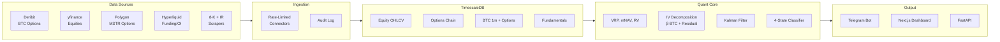

# MACRO Strategy

[](README.md)
[](README.en.md)

### Market-Adaptive Covered-call Regime Optimizer


> **Rotating between MSTR delta exposure and MSTY premium harvest based on volatility regime — quant alpha without options, leverage abuse, or institutional infrastructure.**

대부분의 MSTR/MSTY 투자자는 한 자산만을 장기적으로 보유합니다.
본 시스템은 **변동성 국면(Regime)을 정량 분류**해서, 각 국면이 보상하는 자산으로 자동 회전시킵니다.
알파의 원천은 자산 선택이 아니라 **회전 타이밍**.

---

## The Edge

| Market Regime | Action | Alpha |
|---|---|---|
| 횡보 + IV 높음 | **MSTY**로 옵션 프리미엄 수확 | 변동성 거품을 배당으로 환원 |
| 추세 돌파 | **MSTR (+ MSTU 옵션)**로 상방 캡 제거 | MSTY의 콜 행사 손실 회피 |
| MSTR이 NAV 대비 저평가 | **MSTR 100%** 평균 회귀 베팅 | mNAV mean-reversion |
| 진성 risk-off | **Cash + MSTZ 단기 hedge** | 하방 델타 회피 + 비대칭 페이오프 |

---

## Strategy Architecture — 4-State Allocator

배포된 allocator는 매일 다음 4 state 중 하나로 자본을 배분합니다.
정식 사양: [`docs/STRATEGY.md`](docs/STRATEGY.md).

| State | Trigger (요약) | Allocation |
|---|---|---|
| **ACCUMULATE** | MSTR > MA50 > MA200 (uptrend) 또는 얕은 조정 | MSTR/MSTU 동적 leverage (vol-target 0.5 + mNAV overlay) |
| **HARVEST** | BTC IV>40% **AND** VRP>+3% **AND** BTC RV<50% **AND** MSTR이 MA200 ±10% 횡보 | **MSTY 100%** (옵션 프리미엄 수확) |
| **HEDGE** | MSTR < MA50 < MA200 **AND** VRP ≤ 0 | **MSTZ 100%** (vol chaos에 비대칭 페이오프) |
| **WAIT** | MA200 아래지만 panic 아님 | **Cash 100%** (no edge available) |

전이는 leveraged side(ACCUMULATE/HEDGE)로 들어갈 때 **2일 confirmation**, de-risking(HARVEST/WAIT)은 즉시 — whipsaw vs edge-loss 균형.

### Validation (Phase 2 D5, 2024-05 → 2026-05 LIVE)

| 전략 | CAGR | MDD | Calmar | Sharpe |
|---|---:|---:|---:|---:|
| **macro_trend (이 spec)** | **+36.07%** | **-33.05%** | **1.09** | 0.84 |
| BH MSTR | +7.85% | -77.42% | 0.10 | 0.51 |
| BH MSTY | +4.42% | -71.79% | 0.06 | 0.40 |
| BH MSTU | -57.27% | -98.58% | — | 0.32 |

- TEST window (약세장 12개월) 단독 실행 시 MSTR 대비 **+59pp alpha** — defensive 본분 작동
- Cost stress 25 bps에서도 **+20pp alpha 유지** — 거래비용 robust
- 자세한 walk-forward / parameter sensitivity 결과는 [`docs/STRATEGY.md §6`](docs/STRATEGY.md#6-validation-phase-2-d5)

---

## Signal Architecture — IV Decomposition

순수 MSTR IV 만으론 신호가 오염됩니다 (전환사채 발행 우려, 숏 스퀴즈, mNAV 거품).
BTC IV(Deribit)를 **24/7 leading indicator + denoising baseline**으로 사용해 분해:

```
MSTR_IV(t) ≈ β · BTC_IV(t − Δ) + EquityPremium(t)
              ─────────────────   ────────────────
              Crypto-side          Equity-side
              (24/7 leading)       (residual signal)
```

| EquityPremium 상태 | 해석 | 시스템 액션 |
|---|---|---|
| ≈ 0 | BTC vol이 MSTR vol을 설명 | Core regime 룰 그대로 |
| ↑↑ (+2σ) | 주식판 거품 (squeeze, NAV 과열) | Risk-off 게이트, MSTY exit |
| ↓ (음수) | MSTR이 BTC vol 저평가 | Long 시그널 (advanced) |
| ↑ & BTC_IV ↑ | 진성 + 거품 동조 | Risk-off + downside overlay |

**β estimation**: 90-day rolling regression vs Kalman state-space adaptive — Phase 2에서 walk-forward A/B 후 우월 모델 채택.

---

## Data Stack

| Tier | Source | Coverage | Role |
|---|---|---|---|
| **1. Crypto-Native** *(24/7 leading)* | Deribit (옵션, DVOL), Coinbase·Binance (현물), Hyperliquid·Bybit (펀딩, OI, 청산) | 5+ years | 선행 시그널, denoising baseline |
| **2. Equity** *(US hours, primary)* | yfinance (MSTR/MSTU/MSTY/MSTZ OHLCV + 분배), Polygon Options Basic (MSTR 옵션 chain 2y EOD) | 2 - 25+ years | 거래 가능한 자산의 실제 수익률, MSTR-specific IV |
| **3. Fundamental** | SEC 8-K scrape (MSTR BTC holdings, capital structure), YieldMax IR (MSTY 분배 발표) | 2020-08+ | mNAV(EV-adjusted), 분배 timing |
| **4. Macro** | FRED (DGS10, DXY, MOVE) | Decades | 시장 컨텍스트 |

---

## Tech Stack

| Layer | Tools |
|---|---|
| **Backend** | Python 3.12, FastAPI, SQLAlchemy 2.0 (async), Celery |
| **Database** | PostgreSQL 16 + **TimescaleDB** (hypertables, continuous aggregates, compression) |
| **Cache / Queue** | Redis 7 |
| **Quant** | pandas, numpy, scipy, filterpy (Kalman), vectorbt-style backtester |
| **Frontend** *(Phase 5)* | Next.js 14, Tailwind, TanStack Query, Orval (OpenAPI typed client) |
| **Infrastructure** | Docker Compose, Oracle Cloud Free Tier (Ampere ARM A1, 4c/24GB), Cloudflare Tunnel |
| **Notifications** | Telegram Bot (regime transitions + 9AM daily briefing) |

---

## System Architecture


```mermaid
graph LR
  subgraph S["Data Sources"]
    direction TB
    D[Deribit<br/>BTC Options]
    Y[yfinance<br/>Equities]
    P[Polygon<br/>MSTR Options]
    H[Hyperliquid<br/>Funding/OI]
    F[8-K + IR<br/>Scrapers]
  end

  subgraph I["Ingestion"]
    direction TB
    R[Rate-Limited<br/>Connectors]
    AU[Audit Log]
  end

  subgraph DB["TimescaleDB"]
    direction TB
    OHL[Equity OHLCV]
    OPT[Options Chain]
    BTC[BTC 1m + Options]
    FUN[Fundamentals]
  end

  subgraph Q["Quant Core"]
    direction TB
    IND[VRP, mNAV, RV]
    DEC[IV Decomposition<br/>β·BTC + Residual]
    KAL[Kalman Filter]
    REG[4-State Classifier]
  end

  subgraph O["Output"]
    direction TB
    TG[Telegram Bot]
    DASH[Next.js Dashboard]
    API[FastAPI]
  end

  S --> I --> DB --> Q --> O
```

---

## Project Structure

```
MACRO-Strategy/
├── docker-compose.yml          # core: postgres, redis, app, worker
├── docker-compose.jupyter.yml  # opt-in research env (jupyter only)
├── Makefile                    # ops shortcuts (verify-*, backtest, walk-forward, …)
├── docs/
│   └── STRATEGY.md             # formal allocator spec (priority over README)
├── services/
│   ├── postgres/init/          # extensions + bootstrap SQL
│   └── app/
│       ├── Dockerfile
│       ├── requirements.txt
│       ├── migrations/         # alembic 005: initial → indicators_daily
│       └── src/
│           ├── api/            # FastAPI (health endpoint)
│           ├── core/           # config, db, ingestor base, rate limiter, telegram
│           ├── connectors/     # yfinance / deribit / coinbase / polygon /
│           │                   # binance / hyperliquid / sec_edgar / yieldmax
│           ├── workers/        # celery tasks + beat schedule
│           ├── quant/
│           │   ├── indicators/   # realized_vol, btc_vrp, mnav, mstr_iv,
│           │   │                 # iv_decomposition
│           │   ├── backtesting/  # engine, data, strategies (macro_trend,
│           │   │                 # macro_regime, benchmarks)
│           │   ├── blackscholes.py    # BS pricer + IV inversion
│           │   └── risk_free.py       # FRED DGS1MO fetch
│           └── scripts/        # backfill_*, compute_*, run_backtest,
│                               # walk_forward_validation
└── research/notebooks/         # jupyter (read-only DB role)
```

---

## Roadmap

| Phase | Status | Deliverable |
|---|---|---|
| **1. Foundation** | ✅ Done | Docker stack, schema, 7 ingestors backfilled (MSTR/MSTU/MSTY/MSTZ, BTC daily/DVOL, MSTR holdings, Binance/Hyperliquid funding, YieldMax ROC, Polygon options 2y) |
| **2. Quant Core** | ✅ Done | indicators_daily (RV/IV/VRP/mNAV/β/EquityPremium), per-month historical Polygon backfill, 4-state allocator, walk-forward OOS validation, parameter robustness |
| **3. Live Signal** | ▶ Next | Telegram daily briefing populated with current state + recommended allocation, regime-transition push |
| **4. Dashboard** | ☐ Planned | Next.js mobile-first read-only dashboard |
| **5. Deployment** | ☐ Planned | Oracle Cloud ARM (free tier), Cloudflare Tunnel, daily DB snapshot |
| **2.5 backlog** | ☐ Planned | SEC 10-Q shares-out scraper (mNAV), Kalman β smoother, K-means regime classifier upgrade |

---

## Quick Start

```bash
git clone <repo> && cd MACRO-Strategy
make up                  # 첫 실행: 5-8분 (이미지 pull + Python 패키지 설치)
make verify-health       # → {"status":"ok","db":true,"timescaledb":"2.x.x","redis":true}
make help                # 모든 타깃 리스트
```

| Command | Effect |
|---|---|
| `make up` / `make down` | core 4 서비스 시작 / 정지 (데이터 보존) |
| `make jupyter-up` | 추가로 Jupyter (:8888) — research env |
| `make logs` / `make shell-pg` | 로그 tail / psql REPL |
| `make verify-indicators` / `verify-mstr-iv` / `verify-iv-decomp` | indicator 커버리지 점검 |
| `make backtest` / `backtest-stress` / `walk-forward` | Phase 2 검증 재실행 |
| `make clean` | 정지 + volume 삭제 (확인 프롬프트 — DB 데이터 영구 삭제) |

---

## Risk Management

자유 재량 금지 — 모든 진입·청산은 사전 정의된 게이트와 vol-target 사이징으로 결정.

| 메커니즘 | 작동 방식 |
|---|---|
| **Vol targeting (Hurst-Ooi-Pedersen 2017)** | ACCUMULATE leverage = clamp(0.50 / MSTR_RV20, 0.5×, 2.0×) — RV가 높을수록 leverage 자동 축소 |
| **Overheat de-risk** | MSTR이 MA200 대비 +10% 이상 → leverage ≤ 1.0×, +20% 이상 → ≤ 0.5× |
| **mNAV cap** | mNAV ≥ 1.5 (50%+ premium) → MSTU 비중 0, MSTR-only |
| **Hysteresis** | risk-on(ACCUMULATE/HEDGE)으로 들어갈 땐 2일 confirmation; de-risking은 즉시 |
| **HARVEST narrow gate** | 4중 AND 조건 — IV>40% **AND** VRP>3% **AND** RV<50% **AND** MSTR이 MA200 ±10% — 좁은 vol-seller window만 진입 |

각 게이트의 임계값과 D5 walk-forward 검증 결과는 [`docs/STRATEGY.md §3-§6`](docs/STRATEGY.md#3-per-state-allocation) 참조.

---

## Disclaimer

본 시스템은 **시그널 전용 (Signal-only)**입니다.
자동 주문 실행을 수행하지 않으며, 한국 자본시장법상 투자자문업이 아닙니다.
모든 매매 결정과 결과의 책임은 사용자 본인에게 있습니다.
과거 데이터를 기반으로 한 수리 모델이며 미래 수익을 보장하지 않습니다.
